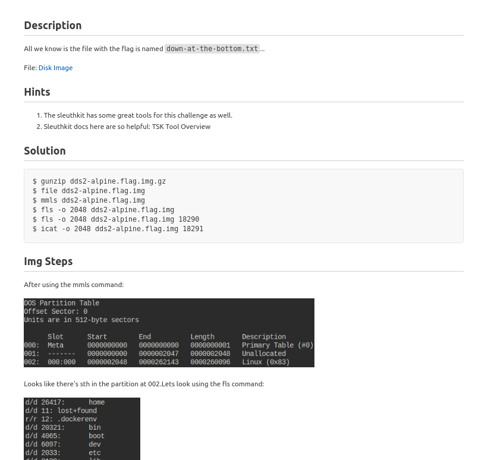

## What are CTF's?
They are exercises in which participants attempt to find text strings, called "flags", which are secretly hidden in purposefully-vulnerable programs or websites.

## Topics

1. __Forensics__

2. __OSINT__ ( coming soon... )

## Example Walkthrough

This is an example snippet of a CTF challenge I solved:

## Resources

1.  [TryHackMe](https://tryhackme.com/login)

2.  [HackTheBox](https://www.hackthebox.com/)

3.  [PicoCTF](https://www.picoctf.org/)

