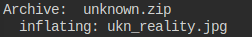
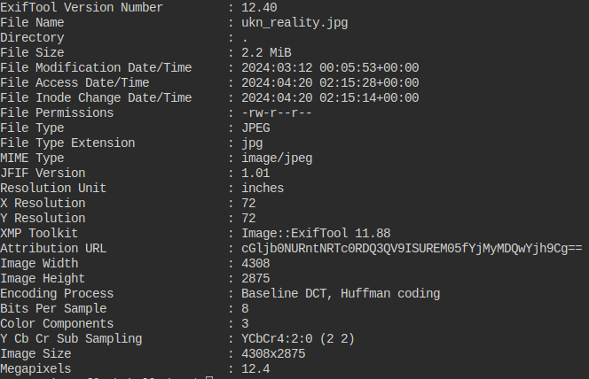
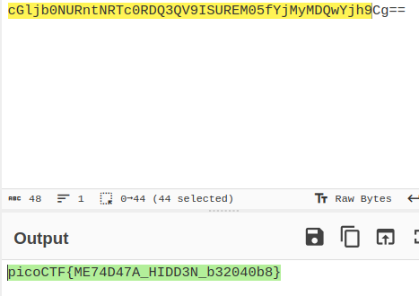
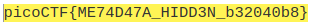

## Description
How about some hide and seek?

File: [File](https://artifacts.picoctf.net/c_titan/129/unknown.zip)

## Hints

1. How can you view the information about the picture?
2. If something isn't in the expected form, maybe it deserves attention?


## Solution

```bash
$ unzip unknown.zip
$ file ukn_reality.jpg 
$ exiftool ukn_reality.jpg
```

## Img Steps

There was an img inside the .zip:



exiftool command:



Look at the Attribution URL.Use cyberchef to decode it:




## Flag



##end
   
   