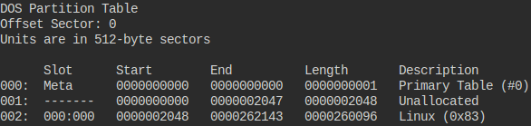
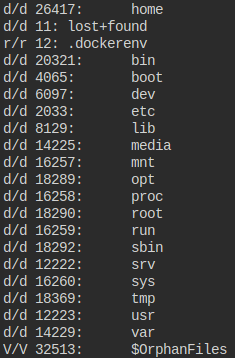

## Description
All we know is the file with the flag is named `down-at-the-bottom.txt`... 

File: [Disk Image](https://mercury.picoctf.net/static/2e54f22211165e9f33a47bdb8a09268b/dds2-alpine.flag.img.gz)

## Hints

1. The sleuthkit has some great tools for this challenge as well.
2. Sleuthkit docs here are so helpful: TSK Tool Overview


## Solution

```bash
$ gunzip dds2-alpine.flag.img.gz
$ file dds2-alpine.flag.img
$ mmls dds2-alpine.flag.img
$ fls -o 2048 dds2-alpine.flag.img
$ fls -o 2048 dds2-alpine.flag.img 18290
$ icat -o 2048 dds2-alpine.flag.img 18291
```

## Img Steps
After using the mmls command:

 

Looks like there's sth in the partition at 002.Lets look using the fls command:

 

Look at the root directory:


Yes! Thats the file.


## Flag


##end
   
   