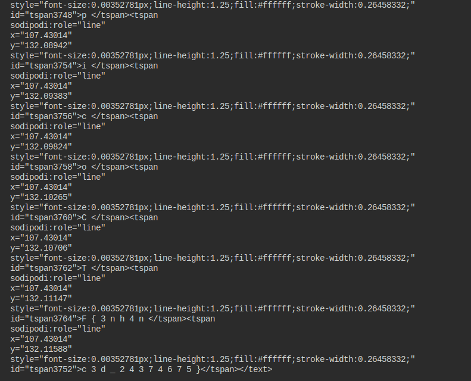

## Description
Download this image file and find the flag.

File: [Img File](https://artifacts.picoctf.net/c/101/drawing.flag.svg)

## Hints

1. None...

## Solution

```bash
$ strings drawing.flag.svg
```

## Img Steps

Viewed the xml code for the flag:

Look closely!



## Flag


##end
   