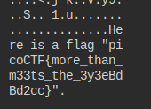

## Description
This 'garden' contains more than it seems. 

File: [Disk Image](https://jupiter.challenges.picoctf.org/static/d0e1ffb10fc0017c6a82c57900f3ffe3/garden.jpg)

## Hints

1. What is a hex editor?


## Solution

```bash
$ xxd garden.jpg
```
xxd - allows you to view and edit files in hexadecimal or binary format

## Flag


##end
   