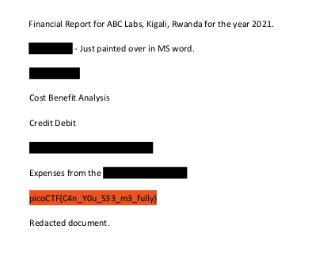

## Description
This report has some critical data in it, some of which have been redacted correctly, while some were not. Can you find an important key that was not redacted properly?

File: [Report](https://artifacts.picoctf.net/c/84/Financial_Report_for_ABC_Labs.pdf)

## Hints

1. How can you be sure of the redaction?

## Img Steps

All I had to do was highlight the redacted text with my cursor:

## Flag

##end
   
   

