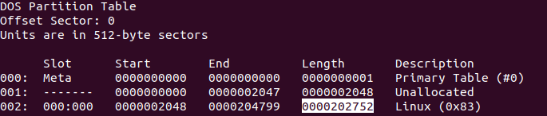
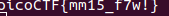

## Description
Download the disk image and use mmls on it to find the size of the Linux partition. Connect to the remote checker service to check your answer and get the flag.

File: [Disk Image](https://artifacts.picoctf.net/c/164/disk.img.gz)

## Hints

1. None...


## Solution

```bash
$ gunzip disk.img.gz
$ mmls disk.img
```
After running the mmls command:



## Flag



##end
   
   
