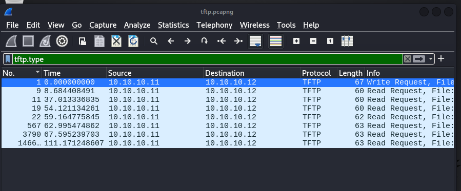
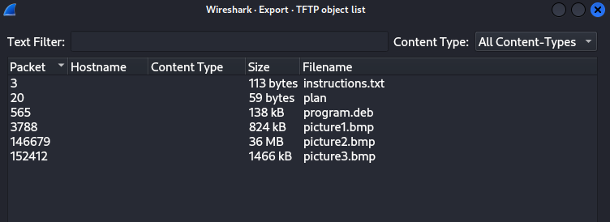
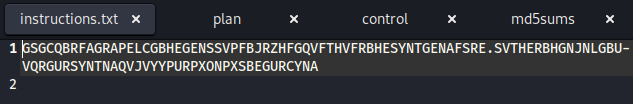
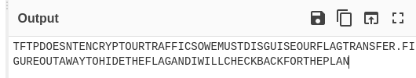
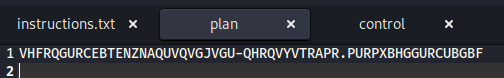
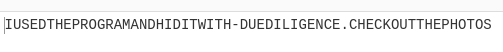
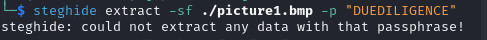
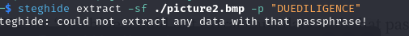
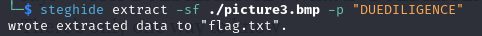
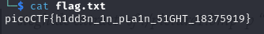

## Description
Figure out how they moved the flag

File: [Image](https://mercury.picoctf.net/static/ed308d382ae6bcc37a5ebc701a1cc4f4/tftp.pcapng)

## Hints

1. None...


## Solution
Download the file and open it up with Wireshark.Filter the packet captures to see the files that were sent & received :
```bash
$ tftp.type
```
 

These are the files.Export them: File -> Export Object -> TFTP 



Look at the instructions txt file first: 



Decode it on cyberchef(ROT13 Encoding):

 

Let me put space in btw:
```
TFTP DOESNT ENCRYPT OUR TRAFFIC SO WE MUST DISGUISE OUR FLAG TRANSFER. FIGURE OUT A WAY TO HIDE THE FLAG AND I WILL CHECK BACK FOR THE PLAN
```

It mentions something about a plan so look at the 'plan' file that we got:



Looks like it also needs to be decoded:

 

Let me put space in btw:
```
I USED THE PROGRAM AND HID IT WITH-DUE DILIGENCE.CHECK OUT THE PHOTOS
```
Ok, so lets check out our program.deb since the message is mentioning it:

They're mentioning steghide-let's use it to extract the flag and since we need a password let's try using "DUEDILIGENCE" as our passphrase:



Oh no! We still have 2 more images let's try them:



It finally worked!

 


## Flag



##end
   