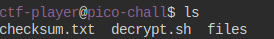
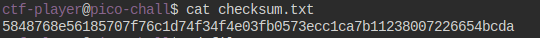
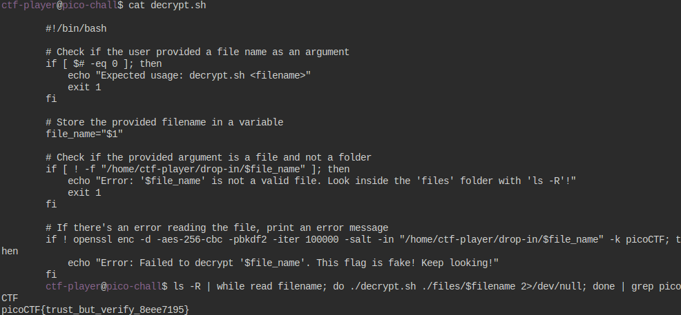
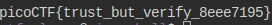

## Description
People keep trying to trick my players with imitation flags. I want to make sure they get the real thing! I'm going to provide the SHA-256 hash and a decrypt script to help you know that my flags are legitimate.

The same files are accessible via SSH here:
ssh -p 62329 ctf-player@rhea.picoctf.net

Using the password 1ad5be0d. Accept the fingerprint with yes, and ls once connected to begin. 

Checksum: 5848768e56185707f76c1d74f34f4e03fb0573ecc1ca7b11238007226654bcda

To decrypt the file once you've verified the hash, run ./decrypt.sh files/<file>.

File: [Challenge](https://artifacts.picoctf.net/c_rhea/11/challenge.zip)

## Hints

1. Checksums let you tell if a file is complete and from the original distributor. If the hash doesn't match, it's a different file.
2. Remember you can pipe the output of one command to another with |. Try practicing with the 'First Grep' challenge if you're stuck!


## Solution

```bash
$ ls -R | while read filename; do ./decrypt.sh ./files/$filename 2>/dev/null; done | grep picoCTF
```
After running the mmls command:

``` 
- The ls -R command lists all files and directories recursively.
- Each file path is passed to the decrypt.sh script for decryption.
- Any error messages generated during decryption are discarded (2>/dev/null).
- Finally, the output is filtered to show only lines containing "picoCTF".
```

## Img Steps

 


 

  


## Flag



##end
   
   
