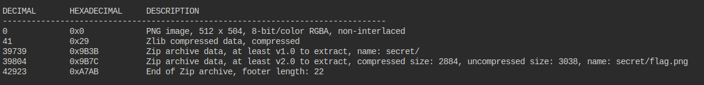

## Description
Every file gets a flag.

The SOC analyst saw one image been sent back and forth between two people. They decided to investigate and found out that there was more than what meets the eye here.

File: [File](https://artifacts.picoctf.net/c/262/flag.png)

## Hints

1. None...


## Solution

```bash
$ binwalk flag.png
```
This is the img we're given:


then:




## Flag


##end

##steg🫣
   


