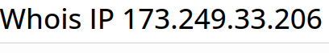

## Description
Someone just sent you an email claiming to be Google's co-founder Larry Page but you suspect a scam.

Can you help us identify whose mail server the email actually originated from?

File: [Email](https://artifacts.picoctf.net/c/499/email-export.eml)

## Hints

1. whois can be helpful on IP addresses also, not only domain names.

## Img Steps

View the file and search for the ip address that the email orginated from:

Go on whois and search for this ip:

Found them!

## Flag

= Wilhelm Zwalina

##end
   