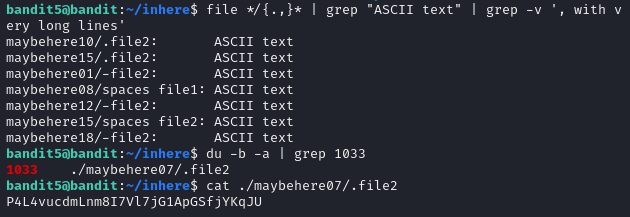

## Over the Wire


## Level 0

```bash
$ ssh bandit0@bandit.labs.overthewire.org -p 2220 
$ ls
$ cat readme
```

## Level 0 - 1


## Level 1 - 2
 


## Level 2 - 3

```bash
$ ls
$ ls -al
$ cat .hidden
``` 

## Level 3 - 4


## Level 4 - 5

```
Level Goal
The password for the next level is stored in a file somewhere under the inhere directory and has all of the following properties:

human-readable
1033 bytes in size
not executable
```




The du command is used to estimate file and directory space usage.


```
(1)file */{.,}*:
This command uses the file utility to determine the type of each file in the inhere directory and its subdirectories.

(2)The */{.,}* :
 Pattern expands to match all files and directories (including hidden ones starting with .) in the inhere directory and its subdirectories.

(3)grep "ASCII text":
This command filters the output of the file command to only show lines containing the string "ASCII text".

(4)grep -v ', with very long lines':
This command further filters the output to exclude lines containing the string ", with very long lines".It removes files that are identified as ASCII text but have very long lines, which may not be relevant to the task at hand.

(5)du -b -a:
This command calculates the disk usage of each file in bytes (-b) and displays all files (-a) in the current directory and its subdirectories.

(6)grep 1033:
This command filters the output of the du command to only include lines containing "1033".
It's used to identify files that are exactly 1033 bytes in size.

```